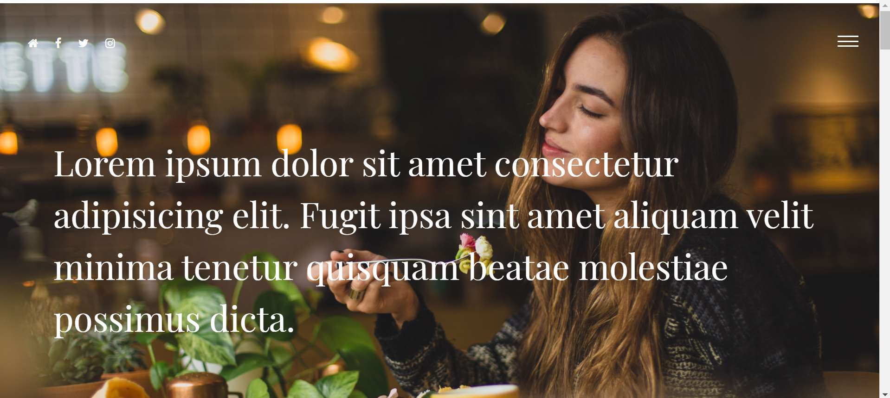
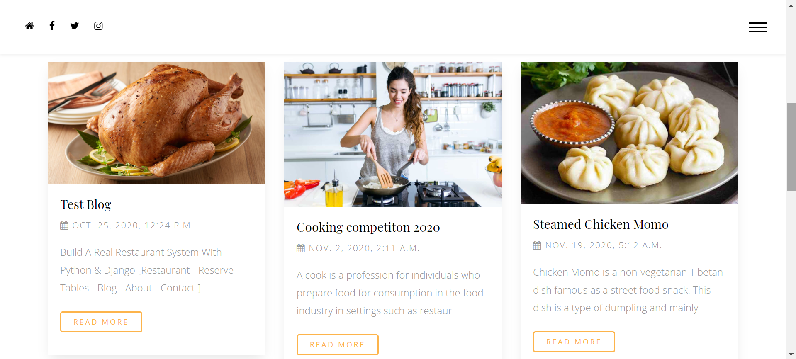

# Build a Restaurant Site with Python and Django

*In this project you'll learn how to build a Restaurant Website with Django and Python!
Django overwhelms a lot of people, and it doesn't have to! If you understand just a few basic concepts, and how django works , you'll see that Django is easy to use.
In this project I'll be developing on a my windows machine, but you should be able to follow along if you're on a MAC or Linux.*

# Features
- Meals
- Ordered a meal
- Reserver a table
- Blog
- User-friendly.
<!--
**[Live Demo](https://iamomar22.pythonanywhere.com/)**
-->
# Tools
## Front-end Part
* HTML
* CSS
* Bootstrap
* JavaScript
## Back-end
* Django
* SQLite 3

# Screenshots of the Project

  
  
  
  

# What you’ll learn
- Introductory Django
- How to Build Simple business Websites With Django
- Download and Install Python
- Dealing With Virtualenv
- Install Django
- How To Create a Django Project
- How To Create a Django App
- How To Design A Model In Django With Database Relationships
- How To Manage URL's
- How to Create Views/Pages
- How to Use Static / Media Files
- How to Use Templates & Template Filters

#### Who this project/course is for:
- This course is aimed towards absolute beginners who want to learn how to  build Websites with Django and Python
    
**Copyright ©** 2020-3020 Md. Omar Faruk

## Go Through This Site Then You Will Know About This Site Properly 🌟✰⭐✪🔯✨
